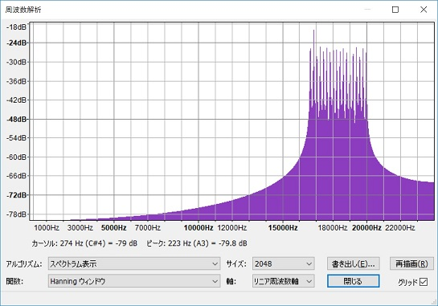
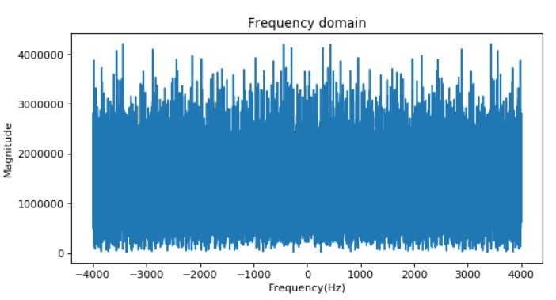

# Ultrasonic communications (STM32L4 DSP w/ MEMS mic)

As an IoT hobyyist, I am becoming interested in developing an IoT demo using DSP with MEMS mic. This project is to study Arm Cortex-M4's DSP capabilities.

## Preparation: STM32L4 platform and FFT test code on MEMS mic

This project uses STM32L476RG as MCU/DSP and MP34ST01-M as MEMS microphone:

The system architecture is as follows:

==> [Platform](PLATFORM.md)

==> [Test code](./basic)

## Ultrasonic communications experiment (FSK modulation)

My first idea was FSK modulation of 18 frequencies (18 symboles) to send data on ultrasonic wave. The method worked very well in a silent room, but did not work in a noisy environment such as a meeting room. I had to come up with another approach, such as spread spectrum.

==> [Experiment](EXPERIMENT.md)

==> [Test code](./ultracom)

## Ultrasonic communications experiment (Chirp modulation)

I tested Chirp modulation as one of spread spectrum techniques. It worked! But the noise problem still remained, and the result was useless in a noisy room. I had to come up with a noise suppression technique such as Chirp compression.

==> [Experiment2](EXPERIMENT2.md)

==> [Test code](./chirp)

## Ultrasonic communications experiment (Chirp modulation with compression)

This time, I employ some compression technique, and chirp appears one time within Time Quantum (TQ), unlike the previous experiment.

### Simulation on Jupyter Notebook

I made some simulation on Jupyter Notebook: https://github.com/araobp/ultrasonic-communication/blob/master/generator/ChirpSimulation.ipynb

The two peaks below are constant noises and chirp signal is under noise level of white noise:

Chirp is identifiable at around 0 Hz:

Chirp is identifiable at around 35000 Hz:

### The first experiment of up x down on STM32L4 DSP (June 10, 2018)

I transmitted very weak chirp signals to STM32L4 DSP with MEMS mic. It worked! But I observed two peaks most of time, since the FFT calculation was performed on a chirp signal split into two within TQ.

### How much time does it take to compute complex FFT of 2048 samples?

The measured value is 3msec for each FFT of 2048 samples at 80MHz system clock. 2048 samples correspond to 20.5msec at 100kHz sampling rate, so 3msec is short enough compared to 20.5msec.

### Next step

I have to come up with some synchronization technique: synchronization of TQ between the transmitter and the receiver.

## My original MEMS mic shield

I have bought [this MEMS mic](http://akizukidenshi.com/catalog/g/gM-05577/): Knowles SPM0405HD4H. The spec is similar to the mic on the expansion board from STMicro. Although this one does not support ultrasonic, it should be OK.

I am going to make my original shield with Knowles MEMS mic:

- Knowles MEMS mic
- LCDs
- LEDs
- Tactile switches
- CAN tranceiver
