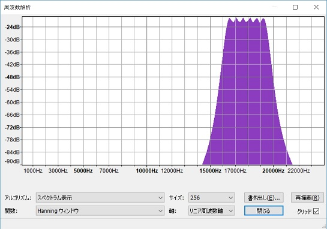
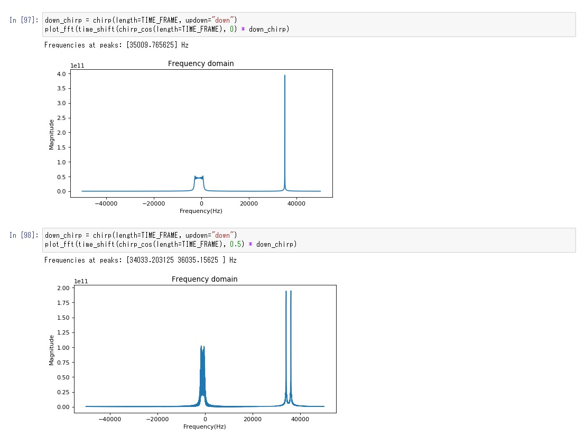

# Ultrasonic communications (STM32L4 DSP w/ MEMS mic)


STMicro gave me STM32L4 evaluation board and a pair of MEMS microphones for free at [a trade show held in Makuhari city](https://www.st.com/content/st_com/en/about/events/events.html/techno-frontier-2018.html), Chiba, Japan. Thanks a lot to STMicro! As an IoT hobyyist, I am becoming interested in developing an IoT demo using DSP with MEMS mic.

## Preparation: STM32L4 platform and FFT test code on MEMS mic

This project uses STM32L476RG as MCU/DSP and MP34ST01-M as MEMS microphone:


The system architecture is as follows:


==> [Platform](PLATFORM.md)

==> [Test code](./basic)

## Ultrasonic communications experiment (FSK modulation)

My first idea was FSK modulation of 18 frequencies (18 symboles) to send data on ultrasonic wave. The method worked very well in a silent room, but did not work in a noisy environment such as a meeting room. I had to come up with another approach, such as spread spectrum.


==> [Experiment](EXPERIMENT.md)

==> [Test code](./ultracom)


## Ultrasonic communications experiment (Chirp modulation)

I tested Chirp modulation as one of spread spectrum techniques. It worked! But the noise problem still remained, and the result was useless in a noisy room. I had to come up with a noise suppression technique such as Chirp compression.



==> [Experiment2](EXPERIMENT2.md)

==> [Test code](./chirp)

## Ultrasonic communications experiment (Chirp modulation with compression)

I tested various Chirp compression techniques by simulating chirp compression and also by implementing test code on STM32L4 DSP.

Test code of FFT[real up-chirp * complex down-chirp] on STM32L4 DSP showed the best result as follows:


==> [Experiment3](EXPERIMENT3.md)

### Conclusion

|Techinique                               | peak magnitude/amplitude              |Compression    |
|-----------------------------------------|---------------------------------------|---------------|
|FFT[Real upchirp * complex downchirp]    | peaks at around chirp frequency * 2 Hz|Very Good, sinc5 filter improves SNR|
|IFFT[FFT[real upchirp]*FFT[real upchirp]]| compressed wave in time domain        |Not good       |
|FFT[Real upchirp * Real upchirp]          | peaks at around zero Hz              |Disturbed by noises|

## Next steps

### Frame synchronization problems

The phase difference between chirp from the transmitter and chirp from the receiver results in two peaks.

Minimize the phase difference for synchronization (to maximize correlation).



I have come up with the following method:


Assuming that the clock accuracy of the transmitter and the receiver is bad, sync position adjustment is required even after synchronization.

### Expressing data in symbol

This implementation use up-chirp and down-chirp to express 0 and 1:

- up-chirp means 0.
- down-chirp means 1.

So one symbol contains 1 bit info.

#### Sync experiment on June 24, 2018

I made the sync code. It seemed to work.

I observed that Magnitude of chirp at a synchronized position (around i=25) was significantly larger than the others. The result below also showed me that one chirp can express multiple symbols: for example, |up|(0), |down|(1), |up0:up1|(2), |down0:down1|(3).

```
Magnitude history:
max: 306946688.0, max_r: 306946688.0, max_l: 46697000.0, s_time: 301404, f_time: 301408, i: 14, i_left: 14, i_right: 78
max: 599477568.0, max_r: 599477568.0, max_l: 22733306.0, s_time: 301382, f_time: 301386, i: 20, i_left: 20, i_right: 41
max: 777540416.0, max_r: 777540416.0, max_l: 53296356.0, s_time: 301408, f_time: 301413, i: 25, i_left: 25, i_right: 40
max: 727269504.0, max_r: 727269504.0, max_l: 248580016.0, s_time: 301386, f_time: 301391, i: 30, i_left: 30, i_right: 40
max: 508824928.0, max_r: 508824928.0, max_l: 447869984.0, s_time: 301413, f_time: 301417, i: 35, i_left: 35, i_right: 42
max: 336429216.0, max_r: 159654848.0, max_l: 336429216.0, s_time: 301391, f_time: 301395, i: 47, i_left: 39, i_right: 47
max: 192139792.0, max_r: 22508948.0, max_l: 192139792.0, s_time: 301417, f_time: 301422, i: 55, i_left: 37, i_right: 55
max: 98077944.0, max_r: 75327512.0, max_l: 98077944.0, s_time: 301396, f_time: 301400, i: 66, i_left: 9, i_right: 66
```

### sinc filter optimization (moving average)

I observed that sinc5 filter improved SNR at around frequencies of peaks, better than sinc3.

## My original MEMS mic shield

I have bought [this MEMS mic](http://akizukidenshi.com/catalog/g/gM-05577/): Knowles SPM0405HD4H. The spec is similar to the mic on the expansion board from STMicro. Although this one does not support ultrasonic, it should be OK.


I am going to make my original shield with Knowles MEMS mic:

- Knowles MEMS mic
- LCDs
- LEDs
- Tactile switches
- CAN tranceiver
