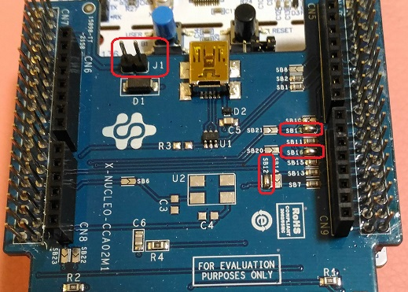
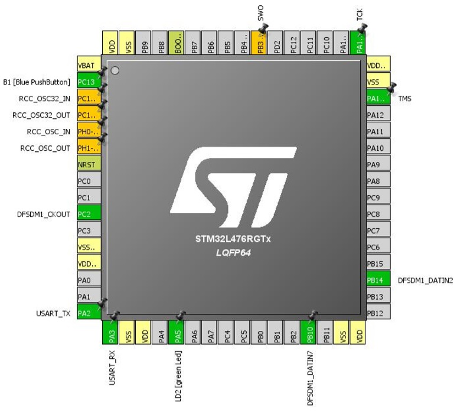
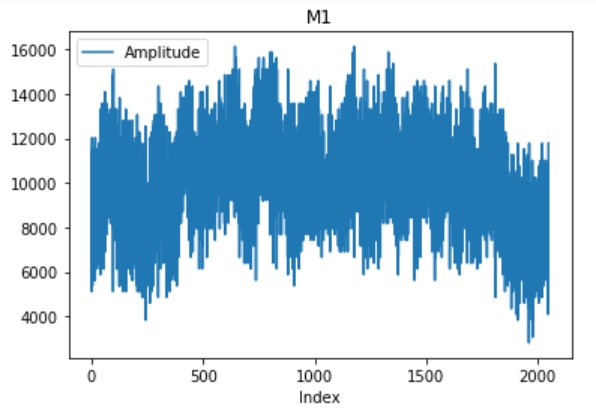
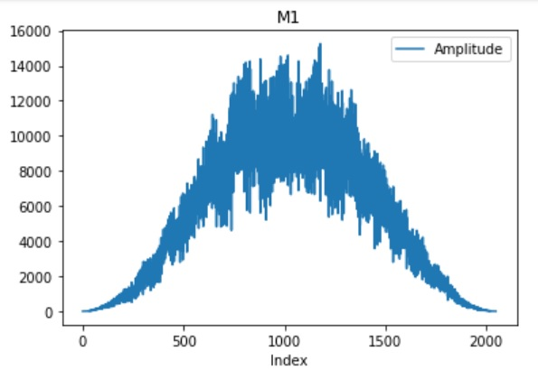
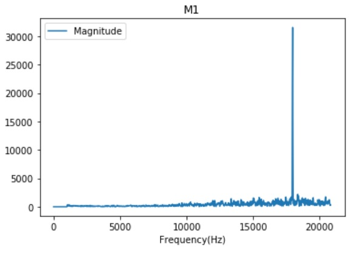
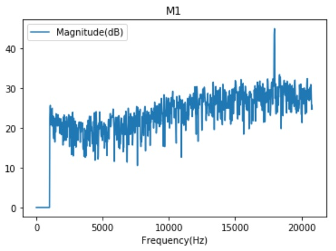
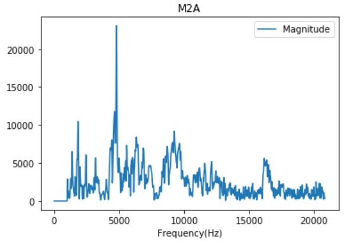

# MEMS Microphones with STM32

## Expansion board

Use [X-NUCLEO-CCA02M1](http://www.st.com/en/ecosystems/x-nucleo-cca02m1.html) expansion board to test MEMS microphones with DFSDM.

As per the MEMS mic datasheet, input clock frequency Max value is 3.25MHz.

Given the system clock rate at 80MHz, the clock divider should be larger than 25.

In this project, to obtain 42kHz sampling rate, the clock divider is set to 60 and the decimation factor to 32: one 2048 samples corresponds to 50msec.

## Bridge/jumper setting for one microphone (M1) acquisition

Solder bridges to be closed

|Bridge|Connector|Pin number|STM32L476RG pin|Description     |
|------|---------|----------|---------------|----------------|
|SB9   |CN10     |28        |PA6, PB14      |MIC_PDM12(M1)   |
|SB12  |CN7      |35        |PC2            |MIC_CLOCK_NUCLEO|
|SB16  |CN10     |28        |PA6, PB14      |MIC_PDM12(M1)   |
|SB17  |CN10     |25        |PB10           |MIC_PDM34(M2)   |

Note: SB9 should be closed instead of SB17 for acquiring both L/R sound on a single PDM line.

Jumper pin setting

|Jumper|Position|Description           |
|------|--------|----------------------|
|J1    |Open    |5V generated on Nucleo|
|J2    |1-2     |Use on-board MIC 1(M1)|
|J3    |1-2     |Use on-board MIC 2(M2)|

Note: M1's L/R pin is pulled-down and M2's L/R pin is pulled-up.

## STM32L476RG pinout configuration (CubeMX)

This configuration use two lines to aquire sound: one for left mic and the other for right mic.

It is also possible to use only one line for both L/R sound acquisition.

## Schematics

- [NUCLEO-L476RG schematic](http://www.st.com/resource/en/schematic_pack/nucleo_64pins_sch.zip)
- [X-NUCLEO-CCA02M1 schematic](http://www.st.com/content/ccc/resource/technical/layouts_and_diagrams/schematic_pack/ae/8d/91/e9/14/bc/4f/0e/x-nucleo-cca02m1_schematic.pdf/files/x-nucleo-cca02m1_schematic.pdf/jcr:content/translations/en.x-nucleo-cca02m1_schematic.pdf)

### UART

|Parameter   |Value    |
|------------|---------|
|Baud rate   |115200bps|
|Data        |8bit     |
|Parity      |None     |
|Stop        |1bit     |
|Flow control|None     |

## Test

### Sine-wave tone generator

I used [this on-line tone generator](http://www.szynalski.com/tone-generator/) to generate sine-wave tone at 18000Hz frequency.

#### PCM data

#### Hanning window applied on the PCM data

#### FFT result

#### FFT result (dB)

### Vacuum cleaner

Vaccum cleaner seems to generate tone at around 5000Hz:

#### FFT result

## References

### Basis

- http://y2kblog.wp.xdomain.jp/pdm_digitalmic_1_stm32l4_dfsdm/
- https://github.com/y2kblog/NUCLEO-L476RG_DFSDM_PDM-Mic
- http://www.fbs.osaka-u.ac.jp/labs/ishijima/FFT-01.html
- http://www.ic.is.tohoku.ac.jp/~swk/lecture/yaruodsp/toc.html

### Guide

- [Getting started with MEMS microphone expansion board](http://www.st.com/content/ccc/resource/technical/document/user_manual/88/5d/3e/6d/9c/ae/42/de/DM00187403.pdf/files/DM00187403.pdf/jcr:content/translations/en.DM00187403.pdf)
- [STM32L4 DFSDM](http://www.st.com/content/ccc/resource/training/technical/product_training/96/b6/2b/ea/72/3f/4e/d5/STM32L4_System_DFSDM.pdf/files/STM32L4_System_DFSDM.pdf/jcr:content/translations/en.STM32L4_System_DFSDM.pdf)
- [Interfacing PDM digital microphones
 using STM32 32-bit Arm® Cortex® MCUs](http://comm.eefocus.com/media/download/index/id-1014142)

#### Arm Cortex-M DSP extension

- [White Paper - DSP capabilities of Cortex-M4 and Cortex-M7](https://community.arm.com/cfs-file/__key/telligent-evolution-components-attachments/01-2142-00-00-00-00-73-48/ARM-white-paper-_2D00_-DSP-capabilities-of-Cortex_2D00_M4-and-Cortex_2D00_M7.pdf)
- [CMSIS](http://www2.keil.com/mdk5/cmsis/)
- [DSP for Cortex-M](https://developer.arm.com/technologies/dsp/dsp-for-cortex-m)
- [CMSIS Real FFT API documentation](https://www.keil.com/pack/doc/CMSIS/DSP/html/group__RealFFT.html)

### MEMS microphone

- [Top ten MEMS microphone vendors ranked](https://www.edn.com/electronics-blogs/20-20khz/4431541/Top-ten-MEMS-microphone-vendors-ranked)
- [STMicro MP34DT01-M](http://www.st.com/resource/en/datasheet/mp34dt01-m.pdf)
- [Knowles SPH0641LU4H-1](http://www.knowles.com/jpn/content/download/5990/105795/version/1/file/SPH0641LU4H-1.pdf)

### Audio

- [Using a PDM microphone](https://curiouser.cheshireeng.com/2014/11/04/using-a-pdm-microphone/)

### Audio signal processing

- [Book](http://floor13.sakura.ne.jp/book03/book03.html)
- [Embarcadero C++ Compiler (Borland C++ Compiler)](https://www.embarcadero.com/jp/free-tools/ccompiler/free-download)
