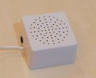
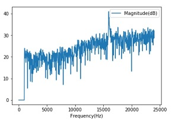
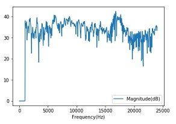

# Ultrasonic communications by STM32L4's DSP and MEMS mic


## Preparation: STM32L4 platform and FFT test code on MEMS mic

This project uses STM32L476RG as MCU and MP34ST01-M as MEMS microphone:


The system architecture is as follows:


==> [Platform](PLATFORM.md)

==> [Test code](./basic)

## Ultrasonic communications experiment (FSK modulation)

==> [Experiment](EXPERIMENT.md)

==> [Test code](./ultracom)

Conclusion: the method (sort of FSK modulation) work very well in a silent room, but did not work in a noisy environment such as a meeting room. I have to come up with another approach, such as spread spectrum.

## Chirp modulation experiment

### Two kinds of noises

I observed two kinds of noises in a room:

- Constant noises at specific frequencies: noises from motors/inverters???
- Bursty noises in a short period: cough, folding paper etc.

I _guess_ Chirp modulation might be suitable for ultrasonic communications in a noisy environment. No proof yet.

### Chirp modulation

Spectrum is spread out like Mt. Fuji:


### Chirp de-modulation

All the frequencies appear in one TQ(Time Quantum). I used [Audacity](https://www.audacityteam.org/) to capture the spectrogram:


Reference: 
- [Chirp compression (Wikipedia)](https://en.wikipedia.org/wiki/Chirp_compression)
- [Chirp A New Radar Technique](http://www.rfcafe.com/references/electronics-world/chirp-new-radar-technique-january-1965-electronics-world.htm)
- [Radar Pulse Compression](https://www.ittc.ku.edu/workshops/Summer2004Lectures/Radar_Pulse_Compression.pdf)

### Frame synchronization (tentative)


### System setting

DFSDM parameters

|Parameter    |Value/setting|
|-------------|-----|
|System clock |80MHz|
|Clock divider|25 (3.2MHz over-sampling)|
|Filter       |sinc3|
|Decimation   |32   |
|Sampling rate|100kHz|


FFT parameters

|Parameter    |Value/setting|
|-------------|-----|
|DMA interrupt|2048 samples/interrupt|

#### Time Quantum (TQ) and transmission speed

Time Quantum: 1/100kHz * 2048samples/interrupt = 20.5 msec

Transmission speed: 8bits * 1000 / (20.5(msec) * 19) = 20.5bps

### Example frame: Ascii "S" character code (0x53)


[WAV file of "S"](./generator/ChirpFrameS.wav) generated by [this Jupyter notebook](./generator/ChirpFrameGenerator.ipynb).

### FFT output from STM32L4 DSP with MEMS mic

I used a very cheap speaker (100yen: $1) with my laptop PC to playback the "S" wav file.



Sweep range: 16000Hz - 16000Hz



Sweep range: 16000Hz - 17000Hz



Sweep range: 16000Hz - 18000Hz


Sweep range: 17000Hz - 18000Hz (2 times in 20.5msec)


Paper rubbing


#### The best chrip signal
|Parameter    |Value   |
|-------------|--------|
|TQ           |20.5msec|
|Sampling rage|100kHz to reduce white noise around the sweep range|
|Sweep range  |17000 - 18000 Hz x 2 times within TQ|

### Chirp expriment on June 1, 2018

It could transmit a character code "S" to the receiver. It showed better reachability. However, I observed the following problems:

- Out of sync.
- Windows media player attenuates the amplitude when the transmission (play back) is ongoing.
- Noises still disturb the communication.

```
[l]:  1, c: 00, h: 1, n: 00, [s]: 0, [b]:  , bits: 0x00, t: 34942
[l]:  1, c: 01, h: 2, n: 00, [s]: 0, [b]:  , bits: 0x00, t: 34962
[l]:  1, c: 02, h: 3, n: 00, [s]: 0, [b]:  , bits: 0x00, t: 34983
[l]: -1, c: 03, h: 3, n: 00, [s]: 0, [b]:  , bits: 0x00, t: 35003
[l]: -1, c: 04, h: 3, n: 01, [s]: 1, [b]: 0, bits: 0x00, t: 35024
[l]:  1, c: 05, h: 3, n: 01, [s]: 0, [b]:  , bits: 0x00, t: 35044
[l]:  1, c: 06, h: 3, n: 02, [s]: 1, [b]: 1, bits: 0x40, t: 35065
[l]: -1, c: 07, h: 3, n: 02, [s]: 0, [b]:  , bits: 0x40, t: 35085
[l]: -1, c: 08, h: 3, n: 03, [s]: 1, [b]: 0, bits: 0x40, t: 35106
[l]:  1, c: 09, h: 3, n: 03, [s]: 0, [b]:  , bits: 0x40, t: 35126
[l]:  1, c: 10, h: 3, n: 04, [s]: 1, [b]: 1, bits: 0x50, t: 35147
[l]: -1, c: 11, h: 3, n: 04, [s]: 0, [b]:  , bits: 0x50, t: 35167
[l]: -1, c: 12, h: 3, n: 05, [s]: 1, [b]: 0, bits: 0x50, t: 35187
[l]: -1, c: 13, h: 3, n: 05, [s]: 0, [b]:  , bits: 0x50, t: 35208
[l]: -1, c: 14, h: 3, n: 06, [s]: 1, [b]: 0, bits: 0x50, t: 35228
[l]:  1, c: 15, h: 3, n: 06, [s]: 0, [b]:  , bits: 0x50, t: 35249
[l]:  1, c: 16, h: 3, n: 07, [s]: 1, [b]: 1, bits: 0x52, t: 35269
[l]:  1, c: 17, h: 3, n: 07, [s]: 0, [b]:  , bits: 0x52, t: 35290
[l]:  1, c: 18, h: 3, n: 08, [s]: 1, [b]: 1, bits: 0x53, t: 35310
[l]: -1, c: 19, h: 3, n: 08, [s]: 0, [b]:  , bits: 0x53, t: 35331
==> bits: 0x53, char: S
```

==> [Test code](./chirp)

## My original MEMS mic shield

I have bought [this MEMS mic](http://akizukidenshi.com/catalog/g/gM-05577/): Knowles SPM0405HD4H. The spec is similar to the mic on the expansion board from STMicro. Although this one does not support ultrasonic, it should be OK.


I am going to make my original shield with Knowles MEMS mic:

- Knowles MEMS mic
- LCDs
- LEDs
- Tactile switches
- CAN tranceiver
