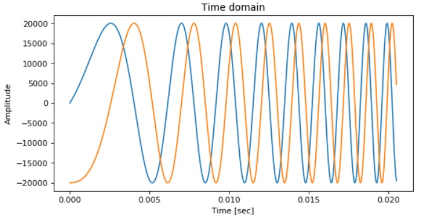

# Learning DSP with ultrasonic communications



[fig] Chirp signal generated by Jupyter Notebook

## Background and motivation

STMicro gave me STM32L4(Arm Cortex-M4) evaluation board and a pair of MEMS microphones for free at [a trade show held in Makuhari city](https://www.st.com/content/st_com/en/about/events/events.html/techno-frontier-2018.html), Chiba, Japan. Thanks a lot to STMicro!

As an IoT hobyyist, I am becoming interested in DSP with MEMS mic.

Also thanks to this: https://github.com/y2kblog/NUCLEO-L476RG_DFSDM_PDM-Mic.

## Project goal

I am a DSP beginner, so I learn DSP by doing: realize "low-power narrow area networking" by cheap DSP and MEMS mic.

## Project documentation

==> [Specification](https://docs.google.com/presentation/d/e/2PACX-1vSd3PQnKqmKbjcGNyNh_gygd175jgfzZYH5iwcEPqmmgiy7k3yYzqqHzfs7u-95jm_9hHgc0ugAvv2U/pub?start=false&loop=false&delayms=3000)

## Platform: STM32L4 platform and FFT test code on MEMS mic

==> [Platform](PLATFORM.md)

==> [Test code](./experiments/basic)

## Mathematical formula expressing ultrasonic wave

I tested frequency-hopping to transmit data over ultra-sonic, resulting in very bad performance at low SNR in a noisy room. So I decided to employ chirp modulation in this project.

==> [Formula](./misc/Formula.ipynb)

## Work ongoing

### Time frame synchronization and orthogonal chirp

This is a working code for STM32L4:

==> [Code](./synchronization)

#### Simulation of time-frame synchronization

Unsynchronized chirp results in two peaks in frequency domain. Assuming that the clock accuracy of the transmitter and the receiver is bad, sync position adjustment is required even after synchronization.

==> [Simulation](./simulation/ChirpSynchronization.ipynb)

#### Simulation of orthogonal chirp

Since I/Q modulation code did not fit into RAM of STM32, I am trying orthogonal chirp instead.

==> [Simulation](./simulation/OrthogonalChirp.ipynb)

#### Experiment of orthogonal chirp (June 29, 2018)

Very weak orthogonal chirp tone was transmitted to the receiver:


The receiver could detect the signal and showed a strong peak of magnitude around zero Hz, as long as its time frame is in sync with the transmitter:


==> [Test code](./synchronization)

### Experiment of synchronous addition (July 7, 2018)

[Condition]
- Volume 18 at my DELL PC (Win10)
- The receiver is 2 meters away from the transmitter(speaker)

[Results]

DFSDM setting:
- sinc5 showed better SNR than sinc3 filter 

Synchrouns addition:
- addition of two frames improved SNR twice, but the ratio between magnitude of upchirp and magnitude of downchirp did not improved.
- addition of two frames tends to become out of sync faster.
- addition of three frames was useless.

FFT per one frame
```
G => S
-,   0.8
-,   0.8
-,   1.1
-,   2.4
-,   3.1
+,   3.4
-,   2.6
-,   1.3
S => S
U,   3.3
-,   1.5
L,   3.4
-,   2.3
S => S
U,   3.2
-,   1.2
-,   2.4
-,   3.1
```

FFT per addition of two frames
```
G => S
+,   3.9
-,   2.6
-,   3.5
-,   1.3
-,   1.8
-,   0.5
-,   1.9
-,   3.0
S => S
U,   4.8
-,   2.7
-,   3.7
-,   4.6
S => S
U,   4.2
-,   2.4
-,   3.6
R,   4.3
```

[Conclusion]
- Go with FFT without synchronous addition, for the time being.

### Developing my original MEMS mic shield

I have bought [this MEMS mic](http://akizukidenshi.com/catalog/g/gM-05577/): Knowles SPM0405HD4H. The spec is similar to the mic on the expansion board from STMicro. Although this one does not support ultrasonic, it should be OK.


I am going to make my original shield with Knowles MEMS mic:

- Knowles MEMS mic
- Character LCD
- Small OEL display
- LEDs
- Tactile switches
- EEPROM

## Experiments I made over the past month

I have made several experiments over the past month to study how data can be transmitted over ultra-sonic wave: FSK, hopping and chirp. The conclusion is to try Chirp modulation to fight with noise.

#### Ultrasonic communications experiment (FSK modulation)

==> [Experiment](./experiments/EXPERIMENT.md)

==> [Test code](./experiments/ultracom)

#### Ultrasonic communications experiment (Chirp modulation)


==> [Experiment2](./experiments/EXPERIMENT2.md)

==> [Test code](./experiments/chirp)

#### Ultrasonic communications experiment (Chirp modulation with compression)

==> [Experiment3](./experiments/EXPERIMENT3.md)
