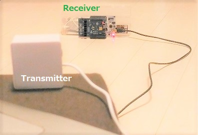
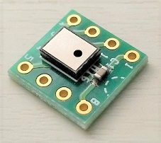

# Ultrasonic communications (Arm Cortex-M4 w/ MEMS mic)

## Background and motivation

STMicro gave me STM32L4(Arm Cortex-M4) evaluation board and a pair of MEMS microphones for free at [a trade show held in Makuhari city](https://www.st.com/content/st_com/en/about/events/events.html/techno-frontier-2018.html), Chiba, Japan. Thanks a lot to STMicro!

As an IoT hobyyist, I am becoming interested in DSP with MEMS mic.

## Platform: STM32L4 platform and FFT test code on MEMS mic

This project uses STM32L476RG as MCU/DSP and MP34ST01-M as MEMS microphone:

The system architecture is as follows:

==> [Platform](PLATFORM.md)

==> [Test code](./experiments/basic)

## Mathematical formula expressing ultrasonic wave

==> [Formula](./misc/Formula.ipynb)

## Work ongoing

### Simulation of orthogonal chirp

I made simulation of Orthogonal chirp (mixing cosine chirp and sine chirp) and synchronous addition. I confirmed that those methods improve SNR on the receiver.

==> [Simulation](./simulation/OrthogonalChirp.ipynb)

### Experiment of orthogonal chirp (June 29, 2018)

Very weak orthogonal chirp tone was transmitted to the receiver:

The receiver could detect the signal and showed a strong peak of magnitude around zero Hz:

==> [Test code](./synchronization)

### Expressing data in symbol

This implementation use up-chirp and down-chirp to express 0 and 1:

- up-chirp means 0.
- down-chirp means 1.

So one symbol contains 1 bit info.

### Improving SNR (signal-to-noise ratio)

- Bandwidth optimization.
- Synchronous addition: multiple sets of 2048 PCM samples.
- Hardware sinc filter optimization on DFSDM.

### Frame synchronization problems

Unsynchronized chirp results in two peaks.

==> [Simulation](./simulation/ChirpSynchronization.ipynb)

I have come up with the following method for synchronization:

Assuming that the clock accuracy of the transmitter and the receiver is bad, sync position adjustment is required even after synchronization, maybe every 8 time frames.

### Developing my original MEMS mic shield

I have bought [this MEMS mic](http://akizukidenshi.com/catalog/g/gM-05577/): Knowles SPM0405HD4H. The spec is similar to the mic on the expansion board from STMicro. Although this one does not support ultrasonic, it should be OK.

I am going to make my original shield with Knowles MEMS mic:

- Knowles MEMS mic
- Character LCD
- Small OEL display
- LEDs
- Tactile switches
- EEPROM

## Experiments I made over the past month

I have made several experiments over the past month to study how data can be transmitted over ultra-sonic wave: FSK, hopping and chirp. The conclusion is to try Chirp modulation to fight with noise.

#### Ultrasonic communications experiment (FSK modulation)

==> [Experiment](./experiments/EXPERIMENT.md)

==> [Test code](./experiments/ultracom)

#### Ultrasonic communications experiment (Chirp modulation)

==> [Experiment2](./experiments/EXPERIMENT2.md)

==> [Test code](./experiments/chirp)

#### Ultrasonic communications experiment (Chirp modulation with compression)

==> [Experiment3](./experiments/EXPERIMENT3.md)
