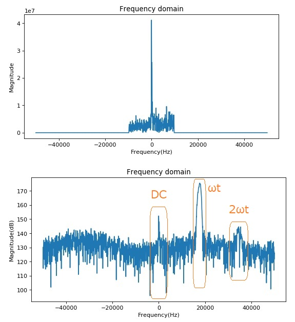

## Time frame synchronization

### Simulation of time-frame synchronization

Unsynchronized chirp results in two peaks in frequency domain. Assuming that the clock accuracy of the transmitter and the receiver is bad, sync position adjustment is required even after synchronization.

==> [Simulation](../simulation/ChirpSynchronization.ipynb)

### Simulation of orthogonal chirp

Since I/Q modulation code did not fit into RAM of STM32, I am trying orthogonal chirp instead.

==> [Simulation](../simulation/OrthogonalChirp.ipynb)

### Experiment of orthogonal chirp (June 29, 2018)

Very weak orthogonal chirp tone was transmitted to the receiver:

The receiver could detect the signal and showed a strong peak of magnitude around zero Hz, as long as its time frame is in sync with the transmitter:

### Successful implementation of ultrasonic receiver (July 10, 2018)

I spent a day to know that 4 times FFT does not fit into 20.5msec time frame (2048 samples/100000Hz) the day before. So I modified the sampling rate to 80MHz /32 divider /32 decimation = 78125Hz, so T of 2048 samples corresponds to 26.2msec.

Weak "Hello World!" tone was sent to the receiver, and it could decode the signal and showed the message!

==> [Code](./synchronization)
